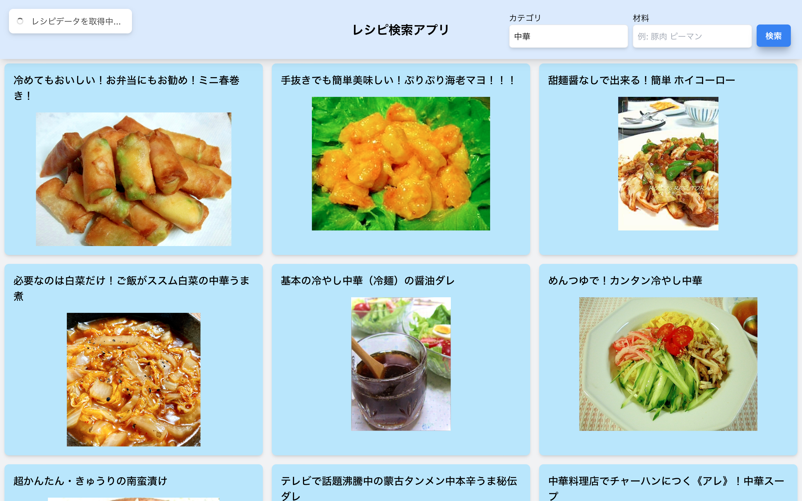

# レシピ検索アプリ

楽天 API を使用しカテゴリ(中華, 和食など)、材料(豚肉, ピーマンなど)を入力してレシピを検索します。
作り方などの詳細は API で取得できないので Rakuten レシピへのリンクを提供します。

## スクリーンショット

<p float="left">
  
   
</p>

## 使う技術

- Tauri (バックエンド: Rust、フロントエンド: TypeScript)
- React

### 外部ライブラリ

- tailwindcss
- zustand
- react-hot-toast

## 学べること

- Rust の基本
- React の基本
- Rust の非同期処理(task の作成)
- 楽天 API の取得方法

## インストール手順

1. リポジトリをクローンします。
   ```
   git clone https://github.com/taiyou1116/tauri-recipe-search.git
   ```
2. 依存関係をインストールします。
   ```
   yarn
   ```
3. アプリを実行します。
   ```
   yarn tauri dev
   ```
